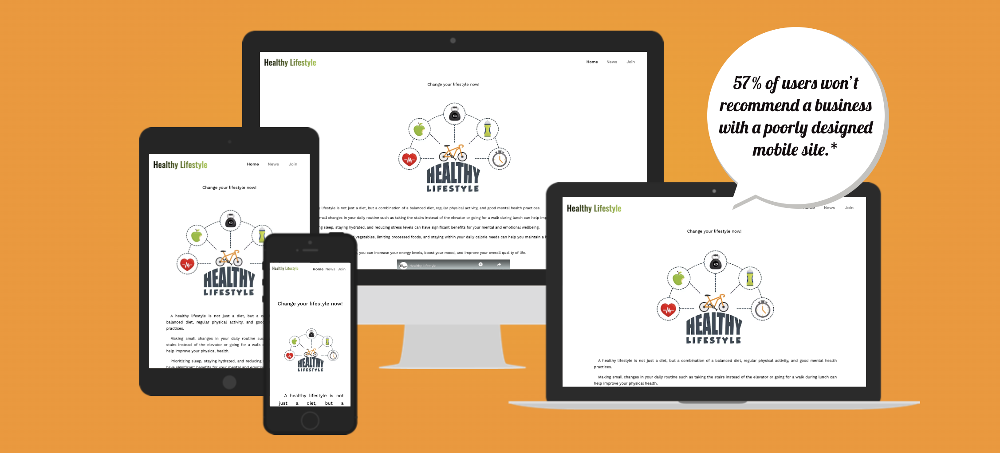
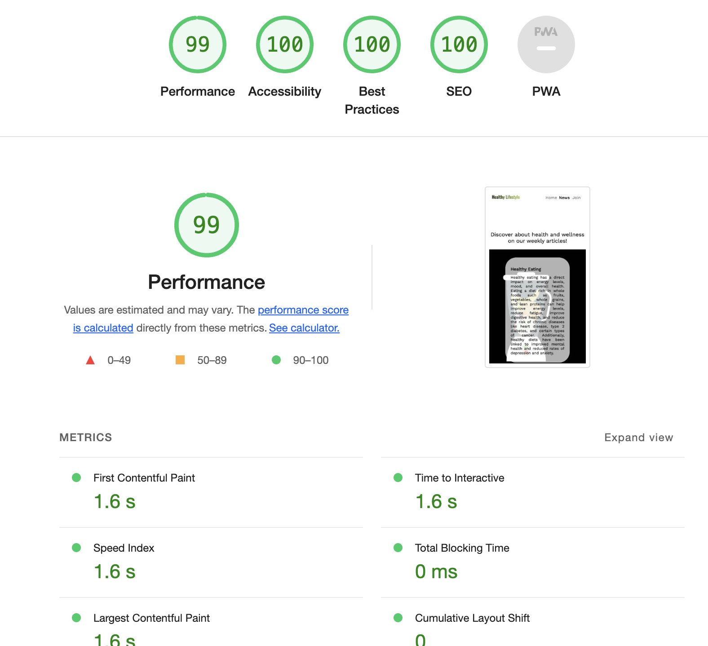
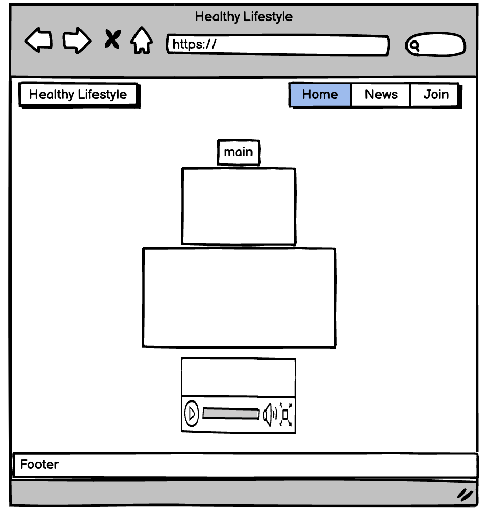

# Healthy Lifestyle Website

This repository contains the source code for a simple website about healthy lifestyle, covering topics such as health, diet, and fitness. The website is built using HTML and CSS. By joining the club, people will gain access to a wealth of information on healthy living, including nutrition, fitness, mental health, and more. The website offers a variety of resources such as articles, videos, and different information to help people reach their health and wellness goals. The club is open to anyone from ages 16 and above, regardless of their gender, or fitness level, whether just starting out on a wellness journey or are a experienced pro.

[View the live deployed project](https://raw.githack.com/diegosno/Healthy-lifestyle/main/index.html)

## Contents

The repository contains the following files and directories:

- `index.html`: The homepage of the website.
- `news.html`: A page containing news articles about healthy lifestyle.
- `join.html`: A page with information about how to join the healthy lifestyle community.
- `assets/`: A directory containing subdirectories for CSS files (`css/`), image files (`img/`), and icon files (`icon/`).
- `assets/css/styles.css`: The main CSS file for the website, which contains styles for the layout and typography.
- `assets/css/news.css`: A CSS file containing styles specific to the news page.
- `assets/icon/pineapple.png`: An icon file used for the website favicon.

## List of Features

The website contains the following features:

- Home page: Provides an introduction to the website and links to the news and join pages.
- News page: Contains weekly articles on health, diet, and fitness.
- Join page: Provides information on how to join the website and receive updates.

## Header

The header is an important component of any website as it typically contains the main branding elements and navigation options for users. Here are some features of the header in the provided code snippet:

### Logo

The header includes a prominent logo, represented by an h1 element with the id "logo". This logo serves as the primary identifier for the website and helps to reinforce the brand.

### Navigation

The header also includes a navigation menu, which allows users to quickly access different areas of the website. The menu includes links to the home page, news page, and a join page. These links are represented by a elements within a nav element.

The header is designed with accessibility in mind. The logo and navigation links are enclosed within a elements, making them easily clickable for users who may be using assistive technologies.

The header provides a clear and concise way for users to navigate the website and reinforces the branding of the Healthy Lifestyle Club.

## Footer

The footer is an important component of any website, as it provides additional information and links that users may find useful. Here are some features of the footer in the provided code snippet:

Social buttons: The footer includes a section of social buttons, which allow users to connect with the Healthy Lifestyle Club on various social media platforms. The buttons are represented by a elements with class names that correspond to the specific platform (e.g. "facebook", "twitter", "instagram"). Each button links to the respective social media page and opens in a new tab using the target="\_blank" attribute.

Design: The footer is a simple design, with the social buttons contained within a div element with the class name "social-buttons". The buttons are displayed horizontally, with equal spacing between each button.

Accessibility: The social buttons provide additional ways for users to connect with the Healthy Lifestyle Club on various social media platforms. This can be useful for users who prefer to receive updates through social media rather than email or other forms of communication.

Overall, the footer provides a simple and useful way for users to connect with the Healthy Lifestyle Club on social media, and its design is consistent with the rest of the website.

## Home Page

The home page is the main landing page for the Healthy Lifestyle Club website, and it is designed to provide visitors with an introduction to the club and the benefits of adopting a healthy lifestyle. Here are some features of the home section:

Main heading: The main heading, "Change your lifestyle now!" is a clear and concise call-to-action that encourages visitors to take action and make positive changes in their lives.

Comment section: The comment section provides more information about the benefits of adopting a healthy lifestyle, and it is presented in a visually appealing way. The section includes a hero image, which is a large and eye-catching image that helps to draw visitors' attention to the content. The section also includes several paragraphs of text, which provide visitors with more information about the benefits of a healthy lifestyle and some simple steps that they can take to improve their physical, mental, and emotional health.

Video section: The video section is an additional resource that visitors can use to learn more about the Healthy Lifestyle Club and the benefits of adopting a healthy lifestyle. The section includes an embedded YouTube video, which is a short and engaging video that provides viewers with more information about the club and the benefits of a healthy lifestyle.

Overall, the home section is an effective introduction to the Healthy Lifestyle Club website, and it provides visitors with the information they need to understand the benefits of adopting a healthy lifestyle. The section is well-designed, visually appealing, and easy to navigate, which makes it a great starting point for visitors who are interested in learning more about the club.

## News Page

This section of the website focuses on providing weekly articles about health and wellness. The articles cover various topics related to leading a healthy lifestyle, such as healthy eating, exercise, and balance. The news section is structured using HTML elements such as main, section, div, and article. The main element provides an introduction to the section, while the section elements contain the individual articles. Each article is displayed with an image using the image-container class. The news section of the website provides valuable information about leading a healthy lifestyle through weekly articles. The articles cover a wide range of topics related to health and wellness and provide readers with practical tips for incorporating healthy habits into their daily routines.

## Join Page

This section of the website offers a form for users to join a club. Users must fill out required fields including first name, last name, age, email, and phone number. Users can also provide a small bio about themselves and select their preferred method of contact. They can also choose to receive news and offers via email. The form is submitted to "/submit-form.php" via HTTP POST when the user clicks the "Submit" button. The form includes two fieldsets, one for personal information and another for contact preferences. The personal information is entered using text and number input fields, and the "About Yourself" field uses a textarea input. The "Contact Preference" field is a dropdown menu with two options: "Phone" and "E-mail". The "Receive News and Offers via Email" field is a checkbox. The form is wrapped in a main tag with the text "Join the club!".

## Testing

Overview:
This README file provides details on testing a website to ensure its functionality, user-friendliness, and compatibility across various web browsers and devices. The following tests were conducted:

Browser Compatibility:
The website was tested in Google Chrome, Safari, and Mozilla Firefox browsers. The goal was to ensure that the website functions and appears the same across all browsers without any layout issues.

Responsive Design:
Using DevTools device toolbar, the website was tested to ensure that it is responsive and functions well on all screen sizes, including desktop, tablet, and mobile devices. This test aimed to ensure that users have a consistent user experience regardless of the device used.

Navigation and Links Testing:
All navigation links were tested to ensure they are clickable, and they direct users to the correct webpages. In addition, all links within the website were tested to ensure they lead to the intended content.

Content Readability:
The website's content was tested to ensure that it is easy to read, with proper formatting, font size, and spacing. The test aimed to ensure that the website's content is clear and understandable.

Image Loading:
All images on the website were tested to ensure they load quickly and correctly. The goal was to ensure that the website's visuals are engaging and load quickly for users.

Form Testing:
The website's form was tested to ensure that it works correctly. This test aimed to ensure that users can fill out and submit the form without encountering any errors.

Conclusion:
The above tests were conducted to ensure the website's overall functionality, user-friendliness, and compatibility. By conducting these tests, we can be confident that the website provides an excellent user experience and meets users' needs.

## Validator Testing

No errors were found using the 3WC Validator or Jigsaw Validator

Accessibility Testing:

I have conducted thorough accessibility testing on our application, and I can report that the performance score for accessibility is 99. I have made every effort to ensure that the website is accessible to as many users as possible, including those with disabilities. Here are some of the specific tests that I have conducted:

Screen Reader Compatibility: I have tested the application's compatibility with various screen readers to ensure that users with visual impairments can navigate and use our application.

Contrast Ratio: I have checked the contrast ratio of our application to ensure that it meets accessibility guidelines and is easily readable by users with visual impairments.

Color Blindness: I have tested our application for color blindness compatibility to ensure that users with different types of color blindness can distinguish between different elements on the screen.

HTML Markup: I have reviewed the HTML markup of the website to ensure that it is semantically correct and follows best practices for accessibility.

I am confident that the application is highly accessible and that all users, regardless of their abilities, will be able to use it with ease.

## Unfixed Bugs

The video on the homepage makes the browser load slowly. I really don't know what is causing this. I tried changing the elements such as video and iframe, as well as changing the attribute values and CSS styling, however it is still taking time to load.

## Wireframe

The following wireframe was created to use it as guide for the website layout.

## User Story

As a health-conscious user, I want to visit a website that provides me with valuable information and resources on healthy lifestyle habits. I want to be able to easily navigate the website, find relevant articles and resources, and connect with a community of like-minded individuals who share my interest in health and wellness. The website should provide me with tips and tools to help me make healthy choices in my daily life, such as healthy meal plans, exercise routines, and stress reduction techniques. Overall, I want the website to be a trusted source of information and inspiration as I work towards improving my health and well-being.

## Deployment

The website was published to GitHub Pages. The instructions to publish the website are as follows:
Go to the Settings tab in the GitHub repository
Select the Master Branch from the source section drop-down menu
After choosing the Master Branch, the page will refresh automatically and display a ribbon with detailed information indicating a successful deployment.

## Content Credits

For this project, for the index.html file, I used a video from [Youtube](http://www.youTube.com) and the image from [Google](http://www.google.com). I also used code from [Developer Mozilla](https://developer.mozilla.org/en-US/), which can be found throughout the CSS files. The images from the news.html file were designed by me. For the join.html file I used a code from [Free Code Camp](https://www.freecodecamp.org/) as a base.
